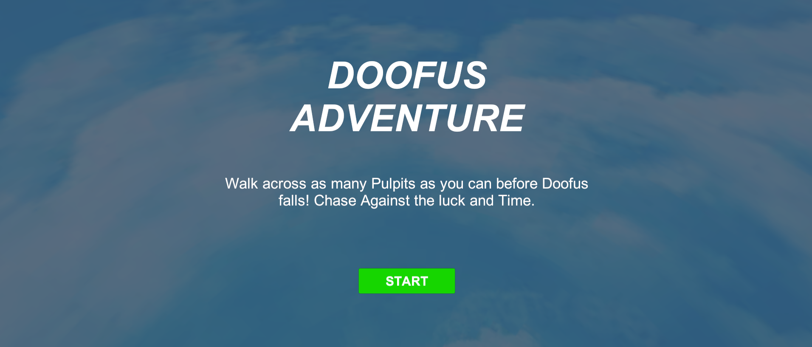
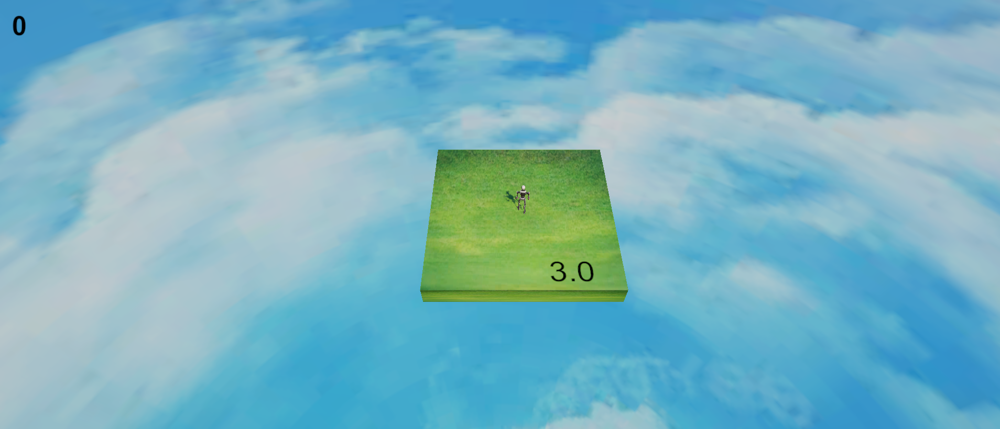

# Doofus Adventure

Welcome to **Doofus Adventure**! Guide Doofus across a series of green platforms called Pulpits. But be careful—Pulpits don't last long! Move fast and survive as long as you can to rack up a high score!

**Author:** Shivakant Kurmi

## 🎮 Gameplay
- Navigate Doofus across the appearing platforms.
- Each platform has a visible timer. When the timer runs out, the platform despawns!
- Score points by successfully reaching a new platform.
- If Doofus falls off the edge or through a despawned platform, it's game over!

## 📸 Screenshots

*(Drop your screenshot images into the `public` folder and rename them to match the filenames below)*

## 🎥 Gameplay Video

*(Drop your video file into the `public` folder and rename it to match the filename below)*

<video width="640" height="360" controls>
  <source src="public/gameplay_video.mp4" type="video/mp4">
  Your browser does not support the video tag.
</video>

*(Alternatively, if you upload your video to YouTube, you can just paste the link here!)*

## 🛠️ Built With
* **Engine:** Unity 6.3 LTS
* **Language:** C#
